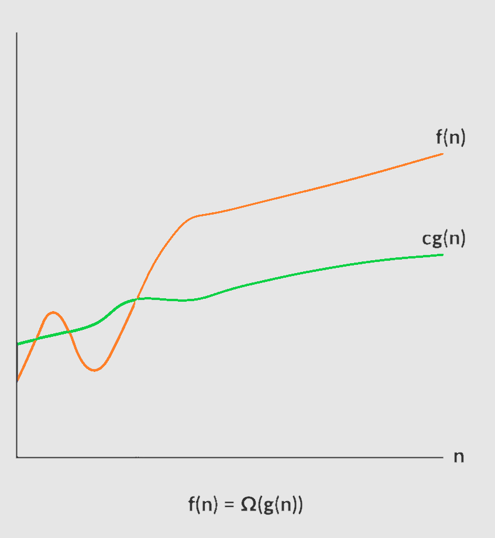
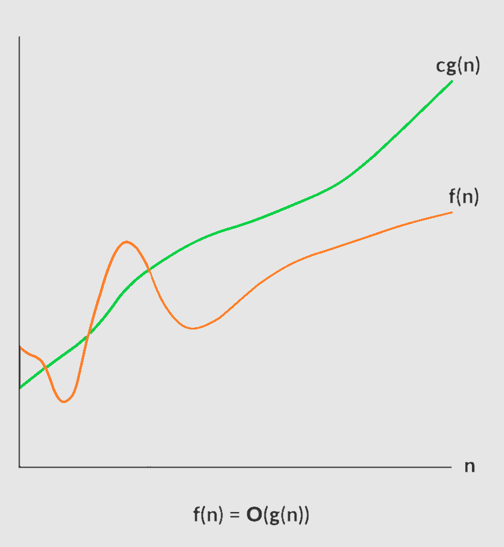
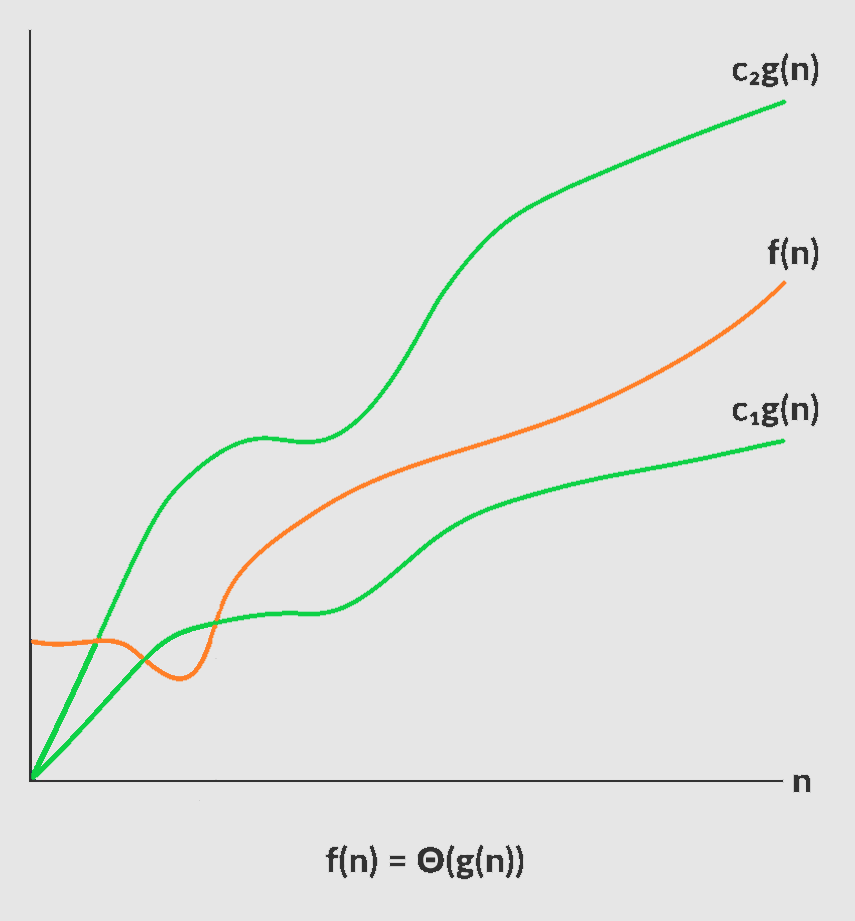

# Space and Time Complexity


1. [What is Space and Time Complexity](#what-is-space-and-time-complexity)
2. [Calculation rules for loops](#calculation-rules-for-loops)
3. [Types of time functions](#types-of-time-functions)
4. [Asymptotic notations](#asymptotic-notations)
5. [Best, Worst and Average case Analysis](#best-worst-and-average-case-analysis)

## What is Space and Time Complexity

### Space Complexity
When we calculate the space, we do not use KB, MB, or GB as unit.
We use **1 unit** for a variable. If it is an array of N element we take it as **N unit** of space.

**Code snippet**
```cpp
int a; // 1 unit
int a, b; // 2 unit
double d1, d2;  // 2 unit
```

**Code snippet**
```cpp
int a = 1, int b = 2; // 2 unit
int sum; // 1 unit
sum = a + b;
cout << sum;
```
**Code snippet**
```cpp
int getSum(int A[n]) { // array A is n unit
    int sum = 0; // 1 unit
    for (int i = 0; i < n; ++i) {
        sum += A[i];
    }
    return sum;
}
```

### Time Complexity
When we calculate how much time the program will take to run, we do not use watch time.
We use **1 unit** for a simple statement. If it is a function call then we must take how much time the function will take.

**Code snippet**
```cpp
int a = 1, int b = 2;
int max;
if (a > b) { // 1 unit
  max = a; // 1 unit
} else {
  max = b; // 1 unit
}
```


## Calculation rules for loops

Loops are nothing but a simple statements that repeat for some number of times. So, we need to count how many times the statements are going to execute.

### Simple loops

**Looping from 0 to n - 1**
```cpp
for (int i = 0; i < n; ++i) {
	cout << i;
}
```

**Looping from n - 1 to 0**
```cpp
for (int i = n - 1; i >= 0; --i) {
	cout << i;
}
```

**Find minimum**
```cpp
int findMin(int arr[], int n) {
	int ans = INT_MAX;
	for (int i = 0; i < n; ++i) {
		if (ans > arr[i]) {
			ans = arr[i];
		}
	}
	return ans;
}
```

**Iterate by multiplying 2**
```cpp
for (int i = 1; i < n; i = i * 2) {
	cout << i;
}
```

**Iterate by dividing 2**
```cpp
for (int i = n; i >= 1; i = i / 2) {
	cout << i;
}
```

### Nested loops

**Two nested loops**
```cpp
for (int i = 0; i < n; ++i) {
	for (int j = 0; j < n; ++j) {
		cout << arr[i][j];
	}
}
```

**Three nested loops**
```cpp
for (int i = 0; i < n; ++i) {
	for (int j = 0; j < n; ++j) {
		for (int k = 0; k < n; ++k) {
			cout << arr[i][j][k];
		}
	}
}
```

**Combination of two different loops**
```cpp
for (int i = 0; i < n; ++i) {
	for (int j = 1; j < n; j = j * 2) {
		cout << j;
	}
}
```

## Types of time functions

| Complexity class			| Name 			|
|---------------------------|---------------|
| O(1) 						| Constant 		|
| O(log n) 					| Logarithmic 	|
| O(n) 						| Linear 		|
| O(n log n)				| Linearithmic	|
| O(n^2^)					| Quadratic 	|
| O(n^3^)					| Cubic 		|
| O(2^n^)					| Exponential 	|


**Time functions in increasing order**

$$
1 < log(n) < √n < n < n^2 < n^3 < ... < n^c < 2^n < 3^n < ... < n^n
$$


## Asymptotic notations
Asymptotic notations tells how the Space or Time function is going to grow when the input tends towards a particular value or infinity. It helps us to simplify the Space or Time function. We can use the simplified form of the function to compare algorithms.

***Omega:*** `Ω`
It is used to find the lower bound of a function.

Let `f(n)` and `g(n)` be the function.
The function `f(n) = Ω(g(n))`, if and only if there exists a constant c > 0 and a natural number n~0~ such that `c∗g(n) <= f(n)` for all n >= n~0~



***Big O:*** `O`
It is used to find the upper bound of a function

Let `f(n)` and `g(n)` be the function.
The function `f(n) = O(g(n))`, if and only if there exists a constant c > 0 and a natural number n~0~ such that `f(n) <= c∗g(n)` for all n >= n~0~




***Theta:*** `Θ`
It is used to find the average bound of a function

Let `f(n)` and `g(n)` be the function.
The function `f(n) = Θ(g(n))`, if and only if there exists a constant c1 > 0, c2 > 0 and a natural number n~0~ such that `c1∗g(n) <= f(n) <= c2∗g(n)` for all n >= n~0~




## Best, Worst and Average case Analysis

**Code snippet**
```cpp
void A(int n) {
	if (some condition on n) {
		// n^2
	} else {
		// n⁎log(n)
	}

	if (different condition on n) {
		// n
	} else {
		// n^3
	}
}
```

**Linear search**
```cpp
int search(int arr[], int n, int target) {
	for (int i = 0; i < n; ++i) {
		if (arr[i] == target) return i;
	}

	return -1;
}
```

